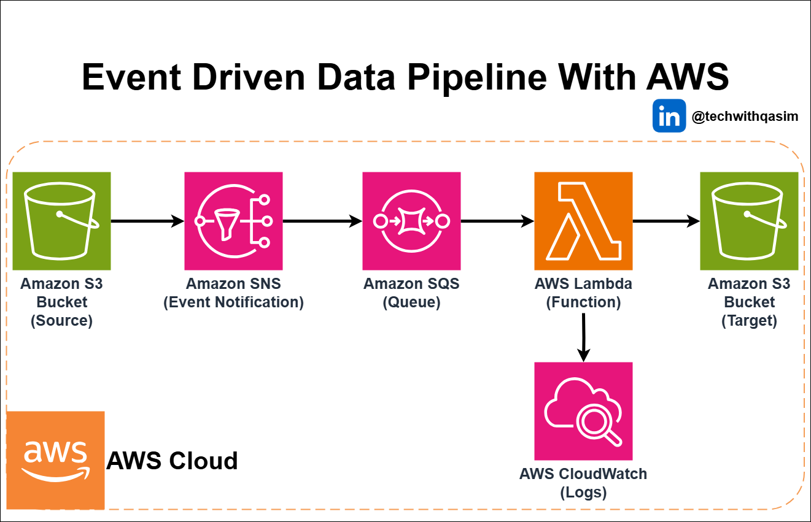

# Event-Driven Data Pipeline with AWS

This architecture demonstrates the implementation of an event-driven data pipeline using AWS services, enabling automated and scalable data processing. The architecture leverages Amazon S3, SNS, SQS, Lambda, and CloudWatch to build a resilient, decoupled, and serverless pipeline for handling data events in real time.

#### **Key Components:**

- Amazon S3 – Acts as the source and target for data storage.
- Amazon SNS – Sends event notifications when new data is uploaded.
- Amazon SQS – Queues incoming messages for reliable delivery.
- AWS Lambda – Processes data asynchronously.
- Amazon CloudWatch – Monitors and logs pipeline activity.

This solution is ideal for automating data ingestion, transformation, and storage workflows while ensuring high availability and cost-efficiency.